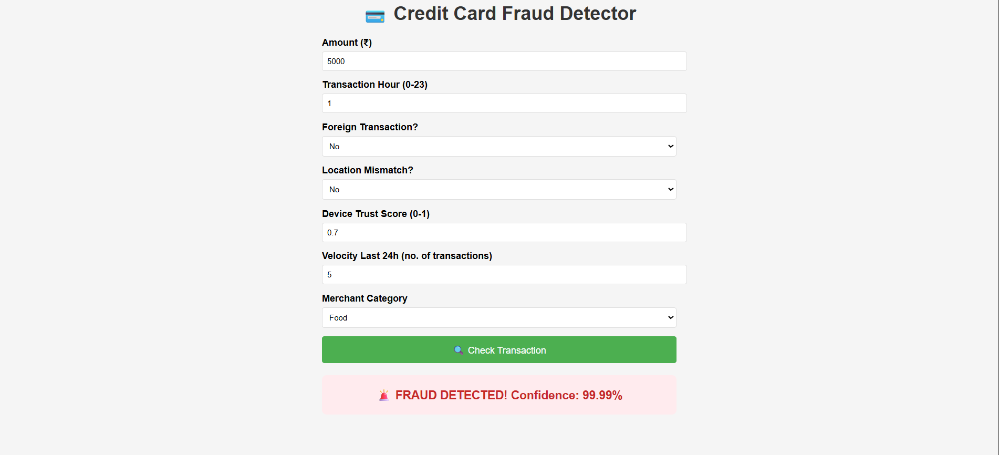
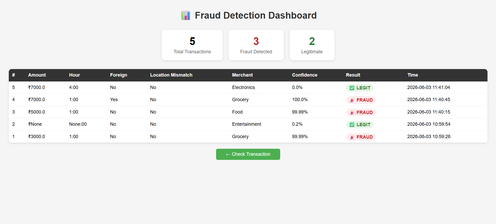

# 💳 Credit Card Fraud Detection System

An end-to-end Machine Learning web application that detects fraudulent credit card transactions in real time.

## 🔍 Features
- Real-time fraud prediction with confidence score
- XGBoost model trained on 10,000 real transactions
- Admin dashboard showing all prediction history
- MySQL database logging every transaction
- REST API for third-party integration

## 🛠️ Tech Stack
- **ML:** Python, XGBoost, Scikit-learn, SMOTE
- **Backend:** Flask, MySQL
- **Frontend:** HTML, CSS, JavaScript

## 📊 Model Performance
| Model | AUC-ROC | Fraud Recall |
|---|---|---|
| Random Forest | 0.998 | 45% |
| XGBoost | 0.9997 | 90% |

## 🚀 How to Run
1. Clone the repo
2. Install dependencies: `pip install -r requirements.txt`
3. Setup MySQL and run the SQL in `database.sql`
4. Run: `python app.py`
5. Open: `http://localhost:5000`

## 📸 Screenshots

### Home Page — Live Fraud Prediction

### Dashboard — Transaction History
